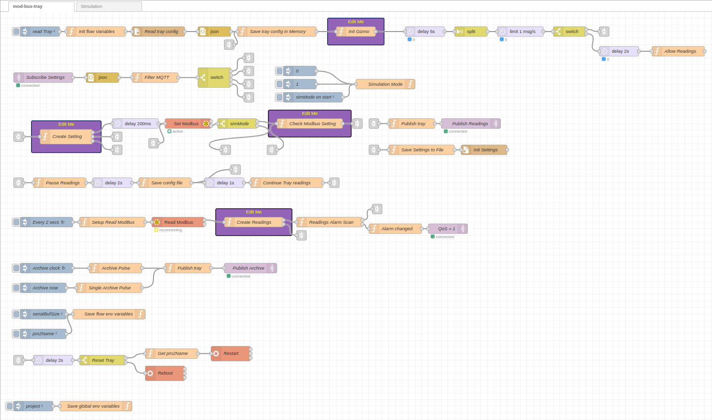
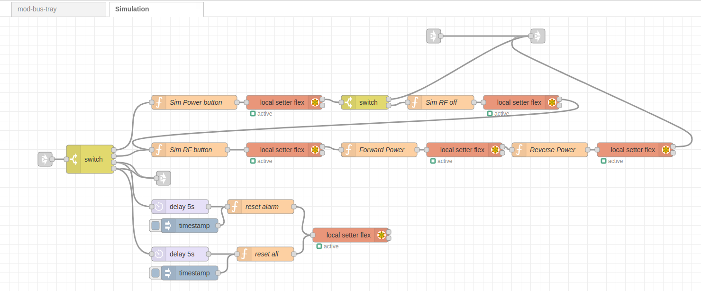

# RF Power Amplifier System
* <a href="https://github.com/bl-mirrotron/mirrotron-rk-pa-tray/" target="_blank">Source code</a>
* [RF power amplifier overview](https://docs.bl-mirrotron.com/#200-mhz-rf-power-amplifier)
* [Control system overview](https://docs.bl-mirrotron.com/)

The RF Power amplifier is <a href="https://rk-microwave.com/wp-content/uploads/2021/12/CA200BW2-7585RP.pdf" target="_blank">custom made solid state RF power amplifier</a> operating at 200 MHz. The amplifier has a gain of about 75 dB and can transform 10mW (10dBm) of RF signal into 320 kW of RF power. The amplifier can operate a pulse length of 1.25mS at a pulse repetition rate of 40 Hz.  The RF Power amplifier connected to the RFQ is shown in Figure 4.

The RF power amplifier requires two timing channels from the [Timing system](https://docs.bl-mirrotron.com/#timing-system).
* <ins>Channel 2</ins>  for the RF Power Amp pulse gate
* <ins>Channel 3</ins>  for the RF Power Amp sample and hold

The RF power amplifier takes the low level signal generated from the [RF source](https://docs.bl-mirrotron.com/#rf-source). The amplifier has a 75dB directional coupler mounted  on its output and the forward and reflected RF signals are available on the front panel. These signals are fed into the [RF power monitor](https://docs.bl-mirrotron.com/mirrotron-rfpower-scope-tray/).

The <a href="https://rk-microwave.com/" target="_blank">manufacturer</a> of the RF power amplifier provides a <a href="https://en.wikipedia.org/wiki/Modbus" target="_blank">Modbus</a> TCP interface so the RF Power amplifier can be controlled and monitored.  The manufacturer provides a detailed <a href="doc/RKAmplifier.csv" target="_blank">spreadsheet of the Modbus table</a> as well. The tray code is written in the <a href="https://nodered.org/" target="_blank">Node-RED</a> programming environment as shown in Figure 1. The tray flow is a modified version of the standard  Blinky-LiteTM tray for serial communications. A Node-RED  <a href="https://flows.nodered.org/node/node-red-contrib-modbus" target="_blank">Modbus TCP node</a> was used handled communications to the amplifier.

To develop and test the interface to RF power amplifier without having to power on the amplifier, a simulation flow as shown in Figure 2 was also developed.

Figure 1.  RF Power Amplifier tray flow with Modbus interface.

 

Figure 2.  RF Power Amplifier simulation tray flow with Modbus interface.

 
